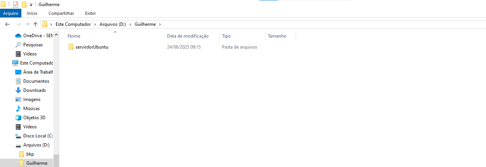

# Preparação de ambiente
Criar maquina virtual para instalar as ferreamentas e dependencias para o estudo de algoritmo e logica de progamção


## Criar o diretório base
Vamos criar um diretório para guardar a nossa máquina virtual .Sera criado no Drive D. Nomeado com o nome do usuario 


## Preparação da Máquina virtual
### Vamos usar a ferramenta de virtualição chamada virtual box


<a href="https://www.virtualbox.org/wiki/Downloads"> Faça o dowload aqui </a>


## Criando a máquina virtual


# Crie uma máquina virtual com aseguintes configurações:
 Primeiro passo:

Crie um diretorio no drive D para alocar a máquina


- coloque 2 processadores
- memoria : 4096


- disco : 100 Gb dinamicamente alocado

- memoria de video : 128
- ISO : Ubuntu 24.04
- idioma : Portugues Brasil

- Usuario : senac 
- Senha  : P@$$w0rd


## Pós instalação:

para atualizar o sistema iremos usar os seguintes comandos
```shell
sudo apt update -y
``` 

```shell
sudo apt upgrade -y
```
ou

```shell
sudo apt update -y && sudo apt upgrade -y
```
## Instalção do cockpit 

Ferramenta para gerenciar o servidor , por meio de um ambiente grafico online


```shell
sudo apt install cockpit -y
```
